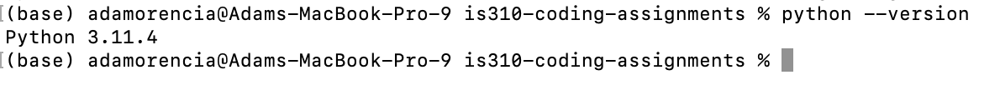
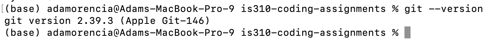

# Init IS310 Homework
## Proof of Installation

1. Python

2. Git

3. VS Code

4. AI Tool/Workflow

My plan is to use AI tools primarily as coding and learning assitants. I am excited to learn how to leverage these tools better because currently I do not think I am getting the most out of them so I most likely will be using these tools based on how they are learned in class. I'm planning to use Copilot in VS code for debugging and format suggestions. I may also use ChatGPT and others for spelling and grammar checks. However, I will not use AI to generate any writing assignments. 

5. Hypothesis Username 

aoren22

